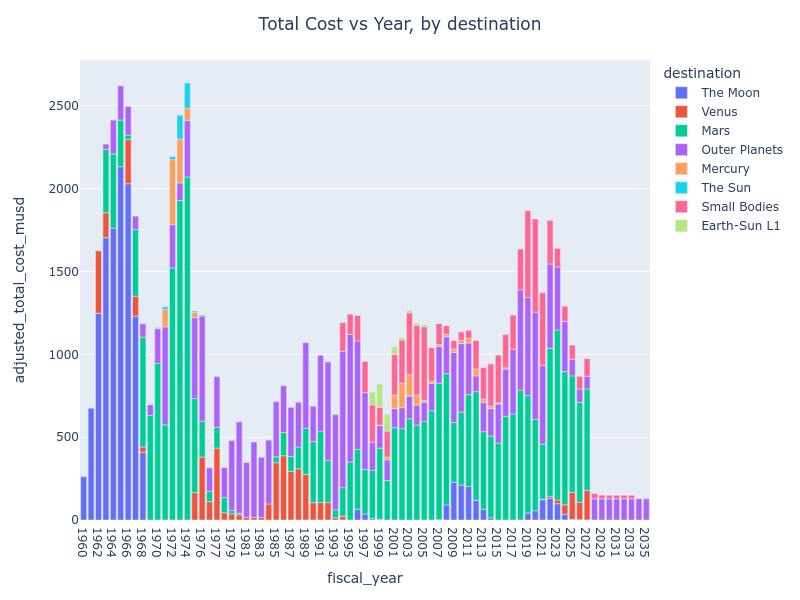
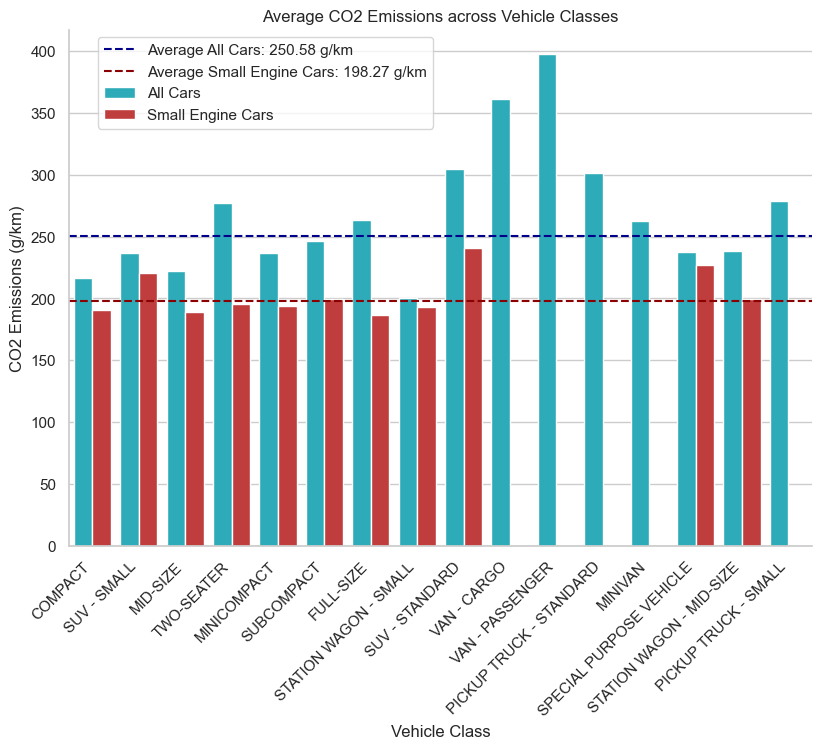

# Data Analysis Projects

## Description

This repository serves as a collection of various small-scale data analysis projects. Each project focuses on distinct datasets and explores various aspects of data analysis using different tools and techniques, including the R programming language, Python, SQL and Power BI.

## Included Projects

### Project 1: Investigating Netflix Movies (Python)

**Description:** This project involves exploratory analysis of the duration of Netflix movies. It includes data cleaning, visualization, and analysis to gain insights into the trends in movie durations.

**Notebook:** [Investigating Netflix Movies Notebook](https://github.com/Nostrand/data-analysis-projects/blob/main/investigating-netflix-movies/notebook.ipynb)

### Project 2: Analyzing NASA Planetary Exploration Budgets (SQL & Python)

**Description:** This project focuses on the analysis of NASA budgets data related to planetary exploration. It utilizes SQL queries to extract, transform, and analyze the budget data, providing insights into funding trends and allocation across different exploration programs.

**Notebook:** [Analyzing NASA Planetary Exploration Budgets Notebook](https://github.com/Nostrand/data-analysis-projects/blob/main/analyzing-nasa-planetary-exploration-budgets/notebook.ipynb)

### Project 3: Case Study HR Analytics (Power BI)

**Description:** This case study delves into HR analytics and dashboard design. It explores a fictitious HR dataset, performs data preparation, analysis, and visualization using Power BI. The project aims to gain insights into employee metrics and provide interactive dashboards for HR decision-making.

**Report:** [Case Study HR Analytics Report](https://github.com/Nostrand/data-analysis-projects/blob/main/case-study-hr-analytics-in-power-bi/case-study-hr-analytics.md)

### Project 4: CO2 Emissions and Bicycle Market Analysis (Python & SQL)

**Description:**  This project explores CO2 emission data for Canadian vehicles and analyze a database from a chain of bicycle stores using Python and SQL. The goal is to gain insights into emission trends and bicycle market preferences.

**Notebook:** [CO2 Emissions and Bicycle Market Analysis](https://github.com/Nostrand/data-analysis-projects/blob/main/co2-emissions-and-bicycle-market-analysis/co2-emissions-and-bicycle-market-analysis.ipynb)

