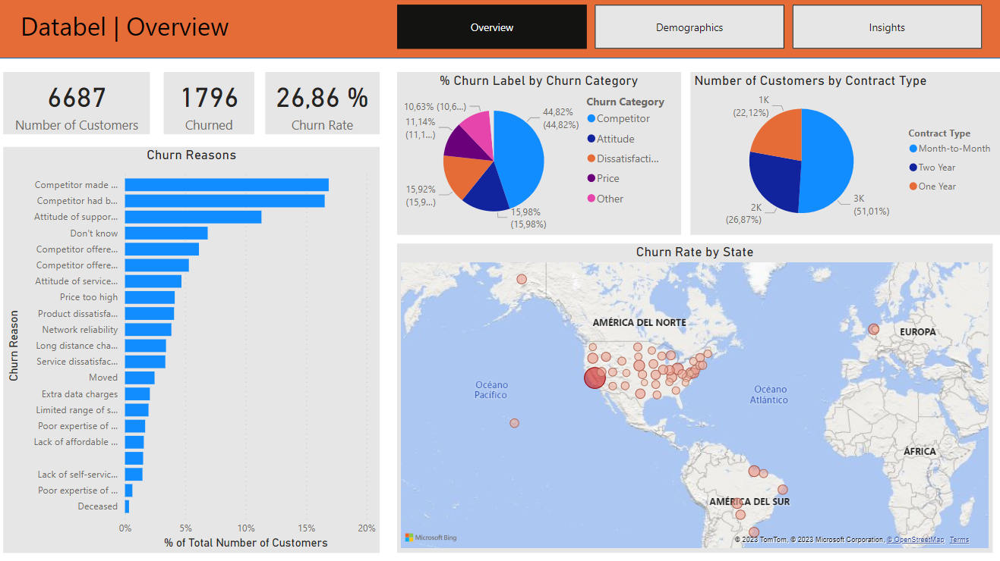
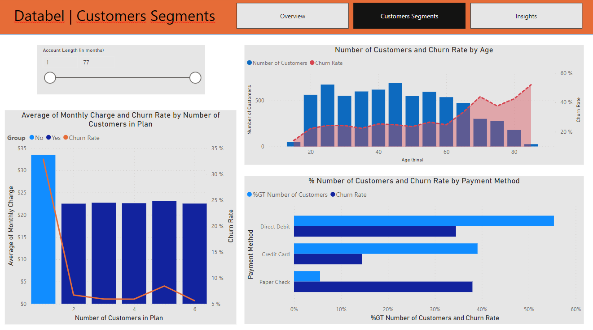
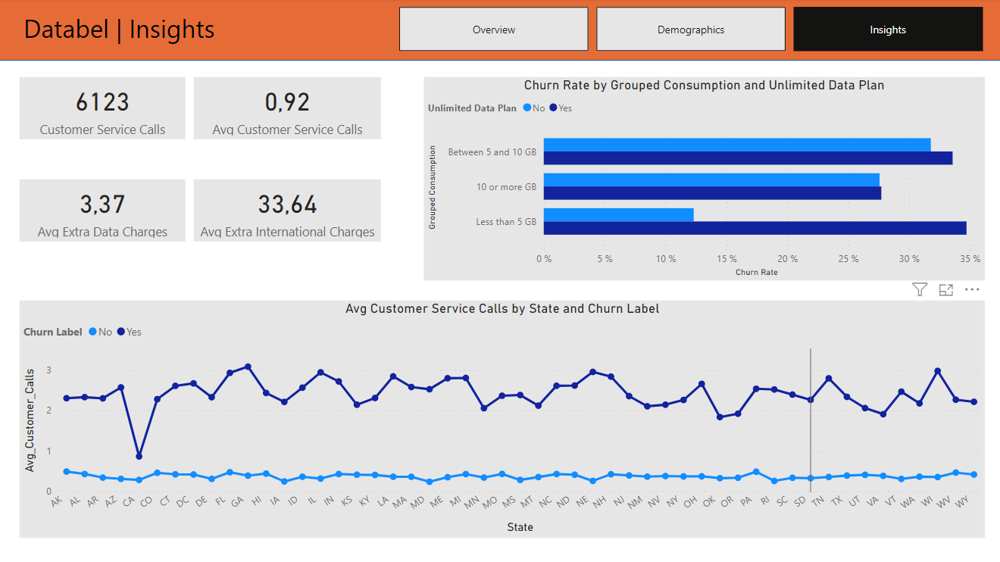

# Case Study: HR Analytics in Power BI

## Background

[Case study from Datacamp](https://www.datacamp.com/courses/case-study-analyzing-customer-churn-in-power-bi), completed in Power BI Desktop. 

## Introduction

What is churn exactly? A good definition is the one from Investopedia: "The churn rate, also known as the rate of attrition or customer churn, is the rate at which customers stop doing business with an entity." You can compare churn with the leaky bucket problem. You can fill the bucket with more water (or new customers in this case), but your overall revenue won't increase if existing customers are leaving your company. It's easier to retain customers than to attract new customers, so for many companies it's a priority to reduce churn.

In this case study, our focus will be on customer churn. We'll be utilizing a fictitious churn dataset from a Telecom provider called Databel. The goal is to analyze why customers are leaving Databel and investigate the factors influencing churn. By delving into the data, we aim to uncover valuable insights that will aid in customer retention and inform strategic decisions.

# Table of Contents

1. [Background](#background)
2. [Introduction](#introduction)
3. [Project Objectives](#project-objectives)
4. [Data Sources](#data-sources)
5. [Data Preparation and Transformation](#data-preparation-and-transformation)
6. [Customer Churn Dashboard](#customer-churn-dashboard)
   - [Overview](#overview)
   - [Customer Segments](#customer-segments)
   - [Insights](#insights)
7. [Recommendations for Enhanced Customer Retention](#recommendations-for-enhanced-customer-retention)
8. [Requirements and Usage](#requirements-and-usage)

## Project Objectives:

The project encompasses various tasks that include:

* Data preparation and transformation: We will conduct thorough data preparation, inspecting the churn dataset, and performing necessary transformations to ensure the data is suitable for analysis.
* Exploratory Data Analysis (EDA): Through EDA techniques, we will gain valuable insights into churn patterns and trends, paving the way for data-driven decision-making.
* DAX Measures and Calculated Columns: We will write DAX measures to calculate essential churn rate metrics and create calculated columns to enhance data analysis capabilities.
* Interactive Dashboard Creation: Utilizing the power of Power BI, we will design an interactive and user-friendly dashboard. This dashboard will consist of insightful chart visualizations that allow for seamless exploration of churn rate and related metrics.

## Data Sources

The Databel dataset consists of 29 different columns and has one row per customer. You'll be analyzing a snapshot of the database at a specific moment in time, meaning there is no time dimension.

The dataset contains numerous dimensions, the first one being Customer_id. The Customer_id is a unique ID that identifies an individual customer. The second column is called Churn Label, and it indicates if a customer churned with "Yes" and "No" labels. The dataset contains various other dimensions, such as demographic fields and information about premium plans.

The dataset contains more than just dimensions, so let's look at some measures. The Total Charges column, for example, takes the sum of all monthly charges billed to a customer. You can see the description of the other columns in here too, but they can all be found in the metadata sheet included in the repository.

## Data Preparation and Transformation

* Imported all necessary data.
* Reviewed the loaded tables, to ensure that columns are correctly formatted and identify potential duplicate data. 
* Created new calculated columns.
* Wrote multiple DAX measures to use with the visualizations.

## Customer Churn Dashboard

The Churn Rate Analytics Dashboard marks a pivotal moment in empowering decision-makers at Databel with actionable insights to enhance customer retention strategies. This section highlights the dashboard's design, emphasizing key visualizations and interactive elements for data exploration and informed decision-making.

### Overview

The HR team is working with department managers to understand their teams and what type of typical roles they are hiring into the organization. This will enable every department to plan for new hiring requests in the future.

In the overview page, we can observe the following key data points for Datalabel:

* Number of Customers:	6687
* Churned Customers:	1796
* Overall Churn Rate:	26.86%

Inspecting the interactive map, we can see that the states with the highest churn rate are:

| State     	 | 	Churn Rate   |
|----------------|---------------|
| California  	 | 63.24%        |
| Ohio       	 | 34.81%        |
| Maryland       | 32.86%        |

### Customer Segments

The Customers Page provides a comprehensive view of customer churn behavior at Databel, offering valuable insights into the composition and characteristics of churned customers. Stakeholders can leverage this section to explore the key attributes of churned customers and gain a deeper understanding of the factors influencing attrition.

Key insights from the Demographics page include:

* Churn Rate by Age: The analysis reveals a notable trend where churn rates increase as customers age. Older customers tend to be more likely to churn compared to younger ones.
* Plan Membership Impact: Customers not enrolled in group plans, paying a higher monthly charge, experience a significantly higher churn rate compared to those with multiple members in their plans.
* Payment Method Influence: Customers using paper checks or debit cards demonstrate a higher churn rate than those utilizing credit cards for payments.

The interactive nature of the visualizations allows for a deeper exploration of the dashboard when using Power BI.

### Insights

The Insights page offers valuable data-driven revelations and actionable takeaways from the churn analysis at Databel. Through a comprehensive analysis of customer churn behavior and interactions, this page empowers stakeholders to gain a deeper understanding of churn patterns and make informed decisions.

The visualizations highlight significant disparities and noteworthy details. Notably, customers from California exhibit the lowest average number of calls to customer service, despite having the highest churn rate among states.

Churn Rate by Data Consumption Group and Unlimited Data Plan:

| Unlimited Data Plan | Below 5 GB 	| 5 to 10 GB | 10 or more GB |
|---------------------|-------------|------------|---------------|
| Yes                 | 34.71% 		| 33.57%	 | 27.72%  |
| No                  | 12.31% 		| 31.78%	 | 27.57%  |

Upong inspecting the interactive visualizations, we can see there is a noticeable difference in churn rate between customers with and without Unlimited Data Plan.

## Recommendations for Enhanced Customer Retention

The comprehensive churn analysis at Databel reveals valuable insights that can drive strategic decisions to improve customer retention. Based on these data-driven revelations, the following actionable recommendations are proposed to empower Databel's stakeholders and enhance customer loyalty:

1. Targeted Customer Service Improvement: Given the significant churn rate differences among states, prioritize customer service enhancements in regions with higher churn rates. Analyze the reasons behind the higher call volumes in certain states, and implement targeted improvements to reduce customer dissatisfaction and increase loyalty.

2. Tailored Data Plans for Low Usage Customers: Customers with unlimited data plans and data usage below 5 GB exhibit a notably higher churn rate. Consider offering personalized data plans or incentives to this segment to improve retention and encourage increased data usage.

3. Promote Group Plan Enrollment: Customers on group plans tend to experience lower churn rates. Develop marketing strategies to promote group plan enrollment, emphasizing cost savings and shared benefits to attract and retain customers within this segment.

4. Payment Method Optimization: Customers paying with paper checks or debit cards demonstrate higher churn rates. Encourage customers to switch to credit card payments, which are associated with lower churn rates, to improve retention.

5. Continuous Monitoring and Analysis: Regularly monitor churn rates, data consumption patterns, and the impact of implemented strategies. Continuously analyze customer behavior to identify emerging trends and refine retention strategies.

By implementing these recommendations, Databel can proactively address customer churn and foster long-term customer relationships, driving sustainable growth and success in the highly competitive telecommunications industry.

## Requirements and Usage

To explore the interactive version of the dashboard, follow these steps:

* Ensure you have Power BI Desktop installed on your system, or access to the cloud version of Power BI.
* Clone this repository or download the PBIX file and datasets from the provided links.
* Open the downloaded PBIX file using Power BI Desktop or the cloud version of Power BI.