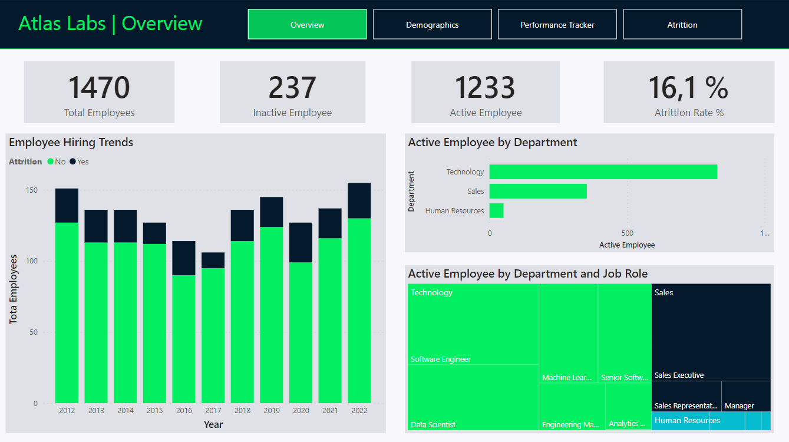
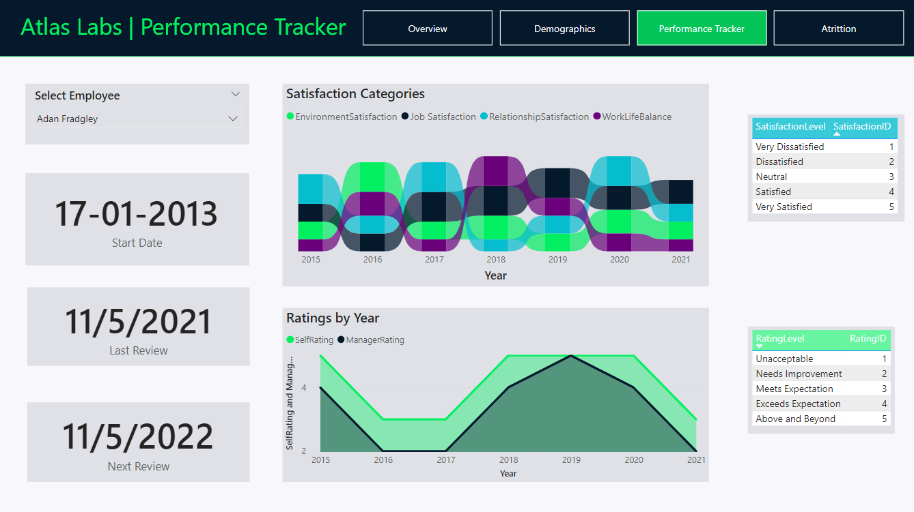

# Case Study: HR Analytics in Power BI

## Background

Case study from Datacamp, completed in Power BI Desktop.

## Introduction

HR Analytics has become increasingly essential for organizations as they strive to make data-driven decisions and optimize their human resources management. With the growing volume of employee data available, HR teams need a robust analytics framework to extract valuable insights and drive strategic initiatives.

The need for HR analytics stems from several key factors. First, organizations recognize that their workforce is one of their most valuable assets. By leveraging HR analytics, they can gain a deeper understanding of their employees, identify trends, and make informed decisions to enhance productivity, engagement, and retention.

Moreover, HR analytics enables organizations to align their HR practices with overall business objectives. Through the analysis of workforce data, HR professionals can identify skill gaps, assess training needs, and ensure the right talent is in place to drive organizational success.

## Business Task and Objectives

The core goal of this case study is to build a report using fictitious datasets from a Tech company called Atlas Labs. Atlas Labs HR team want to be able to monitor key metrics on employees. Their secondary goal is to understand what factors impact employee attrition.

### Tasks:

* Requirements gathering, connecting to data sources, data transformation, building the data model, and writing DAX measures.
* Branding, defining the report layout, and building the report with chart visualizations.

## Data Sources and Model
In this case study, we utilized fictitious data provided by Datacamp to build a data model for HR analytics.

### Data Model Overview

In this case study, we adopted the Kimball Model approach, which involves working with facts and dimensions to build our data model.

### Fact Table

The fact table in our data model is the Performance Ratings table. It contains information about employees' yearly reviews and plays a central role in managing employee performance at Atlas Labs. This table has 11 columns and contains multiple rows per employee.

### Dimension Tables

To provide context to the data, we included several dimension tables in our data model. These tables were imported from CSV files:

- Employee: Contains details about employees, such as their names, roles, and other relevant attributes.
- EducationLevel: Provides information about the education levels attained by employees.
- RatingLevel: Defines different rating levels used for performance evaluations.
- SatisfiedLevel: Describes the satisfaction levels of employees.
- Date: A custom dimension table created with the DAX code from DimDate.txt file, containing detailed date information such as year, quarter, month, and day.

### Schema

Our final data model will follow a snowflake schema. We only have one dimension table that doesn't directly attach to the fact table. This is how our final data model will look.

## Data Preparation and Transformation

Imported all necessary data, renaming each table with "Fact" or "Dim" as needed.

Reviewed the loaded tables, to ensure that columns are correctly formatted as text, numbers and dates.

## HR Analytics Dashboard

The HR Analytics Dashboard represents a significant milestone in empowering the HR team at Atlas Labs with actionable insights to drive strategic workforce decisions. This section focuses on the design and development of the dashboard, highlighting key visualizations and interactive elements that enhance its usability and enable stakeholders to make informed decisions.

The HR Analytics Dashboard incorporates a variety of carefully chosen visualizations and interactive elements to provide a comprehensive overview of critical HR metrics and facilitate data exploration. These features include:

1. **Overview Visualizations:** The dashboard offers high-level visual summaries of key HR metrics such as headcount, attrition rate, and employee demographics. These concise visualizations enable stakeholders to quickly grasp the current state of the organization and identify trends or patterns.

2. **Drill-Down Functionality:** Users can drill down into specific departments or employee groups to gain deeper insights into their performance, attrition rates, and other relevant metrics. This interactive capability allows for a more granular analysis tailored to the needs of different stakeholders.

3. **Comparative Analysis:** The dashboard provides the ability to compare HR metrics across departments, teams, or time periods. Comparative visualizations enable stakeholders to identify performance gaps, disparities in attrition rates, and areas of improvement across the organization.

### Overview

The HR team is working with department managers to understand their teams and what type of typical roles they are hiring into the organization. This will enable every department to plan for new hiring requests in the future.

In the overview page, we can observe the following key statistics for Atlas Labs:

* Total Employees: 1470
* Active Employees: 1233
* Inactive Employees: 237
* Overall Attrition Rate: 16.1%

The departments with the most active employees are as follows:

| Department               | Total Employees | Most Common Role  |
|-------------------------|-----------------|------------------|
| Technology Department   | 828             | Software Engineer|
| Sales Department        | 354             | Sales Executive  |
| Human Resources         | 51              | HR Executive     |

### Demographics

The Demographics page provides a comprehensive view of the employee population within Atlas Labs, allowing stakeholders to gain insights into the composition and characteristics of the workforce. This section offers detailed information about employees, including age distribution, marital status, gender indetity and average salary, with the choice to filter data based on employee stats (active or inactive).

Key insights from the Demographics page include:

* Age Distribution: The majority of employees fall within the 20 to 29-year-old age group, highlighting a younger workforce at Atlas Labs.
* Marital Status: Approximately 42.45% of all employees are married, percentage that changes into singles being the majority at 54.01% when considering only active employees.
* Average Salary: Examining average salaries across different demographic groups, we find that American Indians or Alaskan Natives are the top earners out of the active employees, surpassing $128,000 average salary.

The interactive nature of the visualizations allows for a deeper exploration of the demographic data, enabling stakeholders to make informed decisions and gain a better understanding of the workforce composition.

### Performancer Tracker

The Performance Tracker page provides a comprehensive view of individual employee performance within Atlas Labs. By leveraging historical job satisfaction review data, self-ratings, and manager ratings, this page enables HR professionals and managers to track and analyze employee performance over time.

### Atrittion

In today's dynamic business landscape, understanding employee attrition has become a critical concern for organizations. Attrition, or employee turnover, refers to the voluntary or involuntary departure of employees from an organization. It encompasses the loss of valuable talent, potential disruption to business operations, and increased costs associated with recruiting and training new employees.

This section of the dashboard aims to provide valuable insights into the factors contributing to attrition within Atlas Labs. By analyzing relevant HR data and employing effective data visualization techniques, we can gain a deeper understanding of attrition patterns, identify key drivers, and explore potential strategies to mitigate turnover.

Analyzing attrition patterns enables organizations to anticipate talent gaps and plan for succession. By identifying critical roles and areas prone to higher turnover, Atlas Labs can proactively recruit and develop talent pipelines to minimize disruption.

According to our dashboard:
* Sales Representatives in the Sales Department exhibit the highest attrition rate at 39.8%.
* Recruiters in the HR Department experience an atrittion rate of 37.5%.
* Data Scientists in the Technology Department have an atrittion rate of 23.8%.

Factors such as travel frequency and overtime requirements demonstrate a notable impact on attrition rates. Additionally, employees with less than 6 years of tenure exhibit higher attrition rates.

## Recommendations

Based on the analysis and insights derived from the HR Analytics Dashboard, the following recommendations are provided to support informed decision making and drive positive changes within Atlas Labs:

1. **Data Refresh and Live Dashboard:** It is recommended to implement a data refresh strategy to ensure the dashboard always reflects the most up-to-date information. This can be achieved by connecting the dashboard to live data sources or scheduling regular data updates. By maintaining the accuracy and relevance of the dashboard, stakeholders can make decisions based on the latest information available.

2. **Regular Monitoring and Review:** To leverage the full potential of the HR Analytics Dashboard, it is crucial to establish a routine of regular monitoring and review. By periodically referring to the dashboard and analyzing emerging trends or patterns, stakeholders can identify areas that require attention and take proactive measures to address workforce challenges.

3. **Talent Retention Strategies:** The analysis of attrition rates and identification of key drivers provides valuable insights for implementing effective talent retention strategies. It is recommended to consider initiatives such as career development programs, employee engagement activities, and performance management improvements. By focusing on retaining top talent, Atlas Labs can mitigate turnover risks and foster a motivated and committed workforce.

4. **Performance Tracking and Goal Setting:** The Performance Tracker section of the dashboard enables HR professionals and managers to track individual employee performance over time. This data can be used to set performance goals, provide targeted feedback, and support a culture of continuous improvement. It is recommended to leverage the performance tracking capabilities of the dashboard to optimize workforce performance and drive employee development.

5. **Data-driven Decision Making:** The HR Analytics Dashboard serves as a valuable tool for data-driven decision making. Stakeholders are encouraged to rely on the insights provided by the dashboard when making strategic workforce decisions, such as resource allocation, talent acquisition, and succession planning. By leveraging the power of data, Atlas Labs can ensure that decisions are based on objective information, leading to more effective and efficient outcomes.

By implementing these recommendations, Atlas Labs can leverage the full potential of the HR Analytics Dashboard and make informed decisions that drive organizational success.